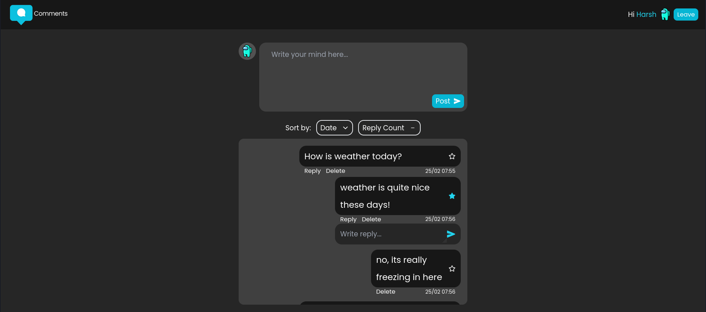
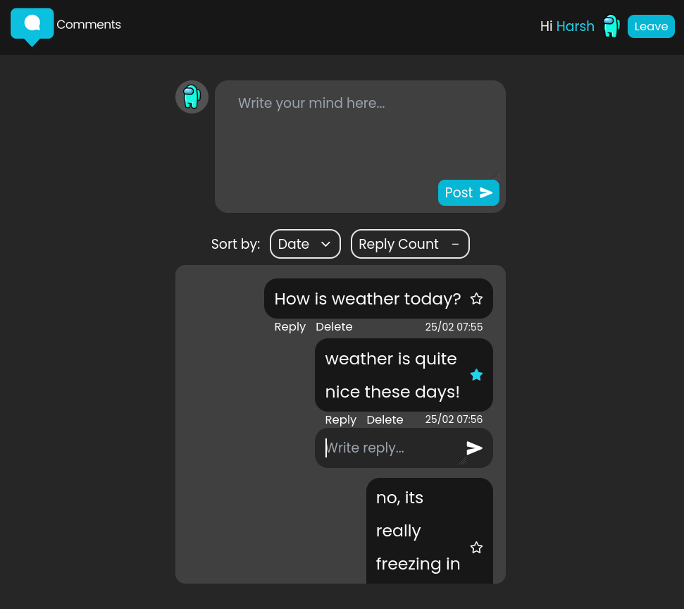
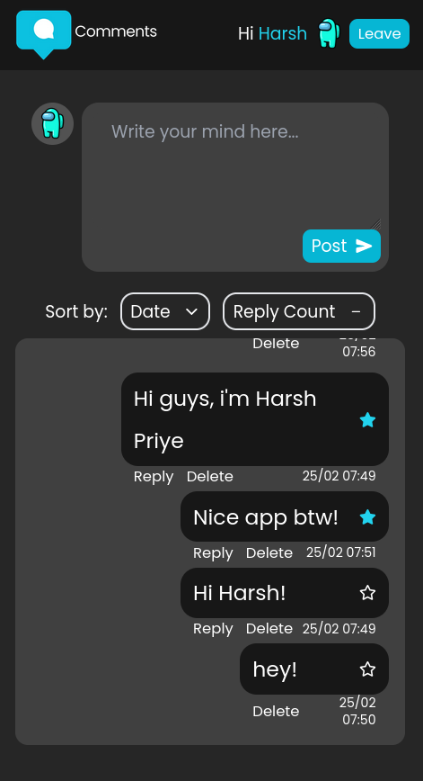

# <b>Comments</b> - A highly functional and resuable react component for a comment section

### This is a reusable component of a three-level comment section, made using React JS and Tailwind CSS.

Try it here: [https://commentbox.vercel.app](https://commentbox.vercel.app/)

## Features
* Responsive Design (thanks to tailwind xD) (looks awesome on all screens!)
* User can Post, Delete and Reply to any comment.
* Supports three levels of replies.
* Sorting:
    * Sort asc/desc by Timestamp.
    * Sort asc/desc by Reply Count.
* User can Star/Unstar any comment.
* Timestamp of comment creation is available.
* Robust Logic:
    * Deleting higher comment delete all its child replies.
    * Optimised comment management.
* Persistent State: All the comment data and user data persists even after page refresh/unload. (using browser's localstorage)

## Screenshots

